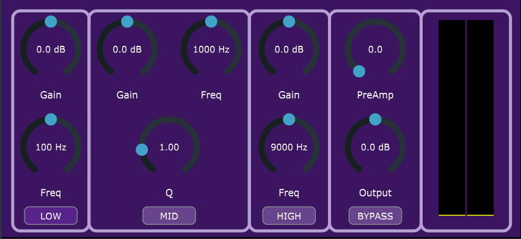

# EQz3 VST Plugin

A 3-band analog-style EQ plugin built with JUCE. Features low, mid, and high bands with preamp drive, gain control and VU metering.

## Features

- Low, mid, and high bands with gain and frequency controls
- Analog-style preamp saturation
- Global output gain and bypass
- Real-time VU meter with RMS and peak display
- Clean GUI layout with real-time parameter labels

## Installation

1.  Download the [EQz3.vst3](EQz3.vst3)
2. Copy it to your plugin folder:
   - Windows: `C:\Program Files\Common Files\VST3` or where you keep your .vst files.
3. Open your DAW and rescan plugins.

## Usage

- **Low / Mid / High Bands** – Control frequency and gain
- **Q** – Adjust midband width
- **PreAmp** – Add analog-style saturation and compression, and nonlinearities to the frequency response
- **Bypass buttons** – Disable individual bands or globally
- **VU Meter** – Shows RMS + peak signal levels
- Adjust the **Output Gain** as needed
- **Double-click any knob** to reset it to its default value
- **TLDR** - For clean EQ-ing keep the PreAmp knob at the lowest setting. For adding "warmth" to the sound use the PreAmp knob.

## License

[MIT License](LICENSE)
